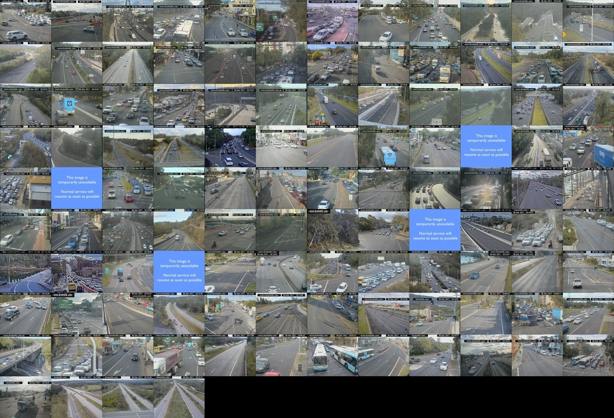

# Sydney Traffic
Displays the state of Sydney's traffic with a grid of public road CCTV cameras.

### Dependencies
* Python >= 3.5
* PIL (`pip install pillow`)

### Usage
Run `build.py` and wait for images to be collected and concatenated. Result will be saved as `out.jpg`

### Known issues
* There are occasionally outages on some or all cameras causing either holes in the result or failure for the script to complete. The soulution is simply "try again later"

### Example

  

